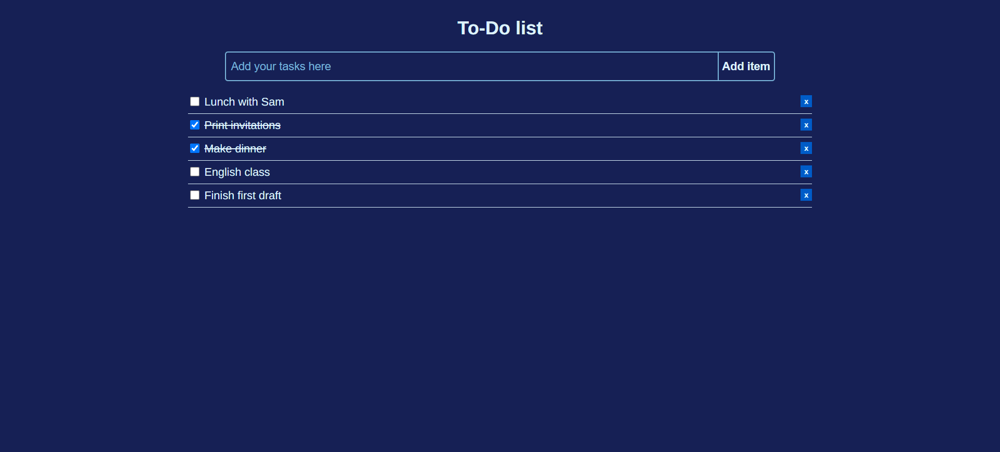

# To do list - Project from Beginner JavaScript

This is a project for Wes Boss's 'Beginner JavaScript' course.

### Screenshot

### Links

- Live Site URL: [https://cl4ram.github.io/to-do-list/](https://cl4ram.github.io/to-do-list/)

## My process

- Vanilla JS custom events

